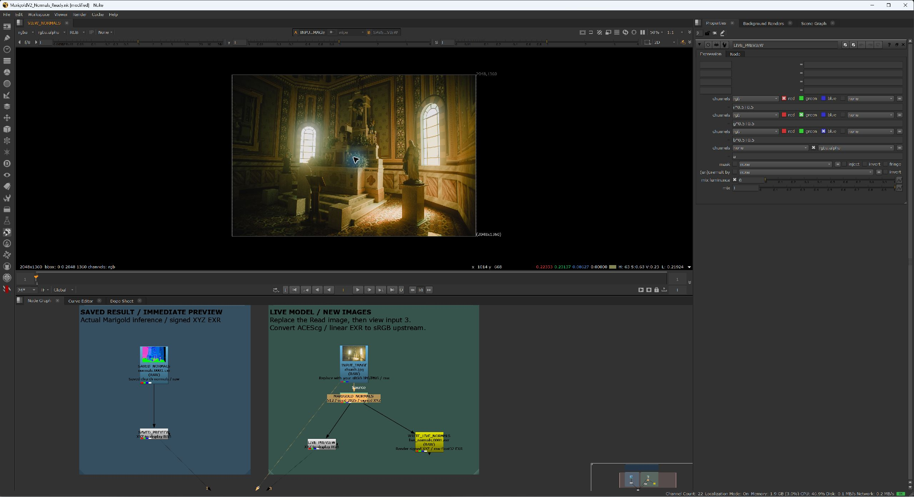
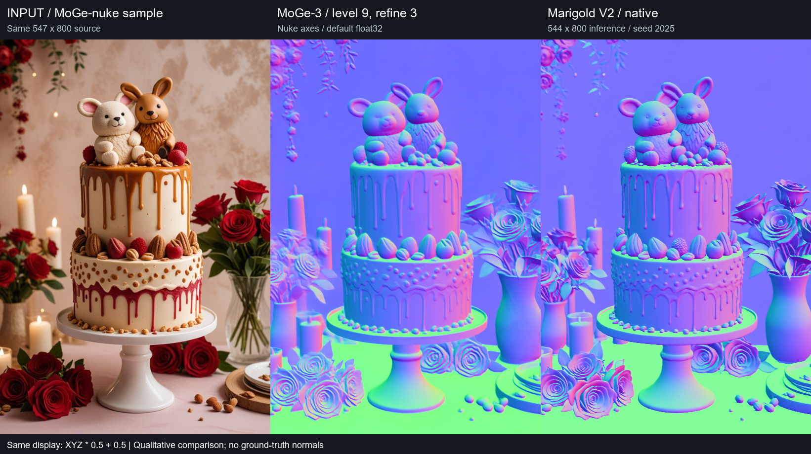
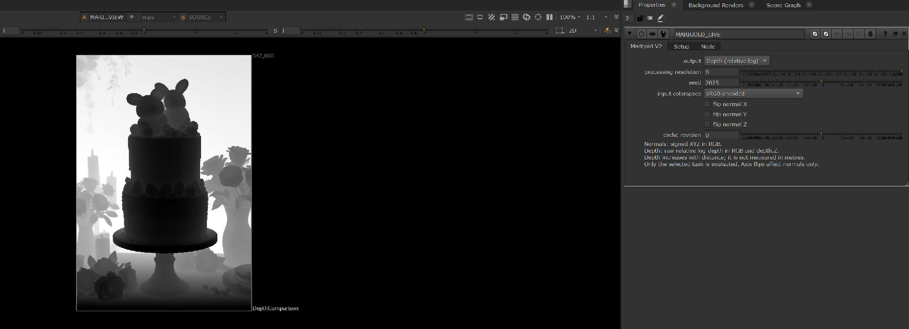
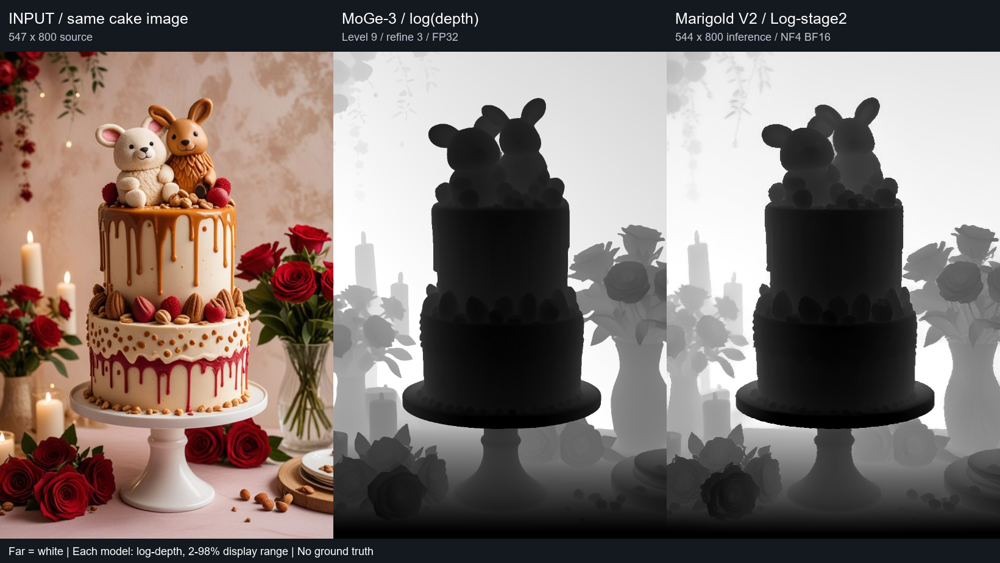

# Marigold V2 for Nuke

Camera-space **normals and relative depth** from images and image sequences, using [Marigold V2](https://github.com/huawei-bayerlab/marigold-v2).

Connect an image and choose **Output → Normals / Depth** in one Marigold V2 node. The UI follows MoGe-nuke's main controls / Setup layout. Only the selected task runs. A resident Python process performs GPU inference over localhost; a native OFX handles pixels and caching, and a small Nuke wrapper adds `depth.Z`.

| Output | RGB | Extra channel | Typical use |
|---|---|---|---|
| Normals | Signed camera-space XYZ | — | Relighting and direction-based masks |
| Depth | Raw relative log-depth, repeated in RGB | `depth.Z`, identical raw values | Depth masks and artist-adjusted depth effects |

**Depth is not a distance in metres.** Larger values mean farther away, but scale and offset are unknown per image. Keep raw data for compositing; normalize a separate display branch for viewing. [Depth workflow and comparison](docs/DEPTH_COMPARISON.md).

**Validated:** Normals in Nuke 17.1v1 / Windows / RTX 5070 Ti 16GB at long edge 512. Depth inference and task switching on H200; Depth channel/export tests in Nuke 17.1v1.

[한국어 안내](docs/README.ko.md) · [Downloads](https://github.com/tardis7732/MarigoldV2-Nuke/releases/latest) · [Node reference](docs/NODES.md)


*Actual Nuke capture. The Viewer displays a rendered EXR through `SAVED_PREVIEW`; the live OFX branch is on the right. Display RGB = XYZ × 0.5 + 0.5.*

<details>
<summary>Original image in the same Nuke graph</summary>



</details>

## MoGe-3 vs Marigold V2



Both models processed the same cake image from the referenced MoGe-nuke README on an H200. In this example, Marigold preserves more visible eye, mouth and strawberry detail; MoGe produces smoother broad surfaces. This is a qualitative comparison of one image without ground-truth normals.

[Matched detail crops, settings and measurements](docs/MODEL_COMPARISON.md) · [Nuke comparison with signed EXRs](https://github.com/tardis7732/MarigoldV2-Nuke/releases/download/v0.1.0/MarigoldV2-Nuke-model-comparison.zip)

## Depth comparison



*Actual Nuke capture: saved cloud Depth in the Viewer, with the selected live node's Output control on the right.*



MoGe-3 estimates metric depth; Marigold's Log-stage2 predicts relative log-depth. For this visualization, MoGe depth is converted to log space and each model is displayed with its own 2–98 percentile range. Raw EXRs remain unchanged. In this sample, Marigold shows more small surface variation while MoGe is smoother; there is no ground-truth depth to rank accuracy.

[Detail crops, timings and Nuke depth workflow](docs/DEPTH_COMPARISON.md) · [Raw EXRs and Nuke example](https://github.com/tardis7732/MarigoldV2-Nuke/releases/download/v0.2.0/MarigoldV2-Nuke-depth-comparison.zip)

## Video example


[Comparison MP4](docs/media/video-comparison.mp4) · [Validation data](docs/video-validation.json)

The first four seconds of [Airam Dato-on's Pexels clip](https://www.pexels.com/video/urban-street-life-with-people-walking-by-historic-building-35958383/) were sampled at 12 fps. All **48 frames** were rendered through the actual Nuke OFX. There is no temporal smoothing or frame interpolation. Each frame is estimated independently, so orientation and surface details can flicker.

## How it works

```text
Read / sRGB → Marigold V2 ┬→ Display mapping → Viewer
              Output     └→ Write EXR (raw, float32, all channels)
                    │
             localhost:47822
                    │
         Python daemon / CUDA / Marigold V2
```

- Automatic daemon startup, resident model and per-node last-result cache.
- Output, inference resolution, seed, input encoding and normal-axis sign controls.
- Normals: signed XYZ, renormalized after resizing. Depth: raw Log-stage2 prediction, resized without clamping or normalizing. Alpha = 1 for both.
- Switching tasks swaps the task-specific LoRA and VAE decoder weights on one shared GPU backbone. Task weights are cached in system RAM; both tasks are not inferred together.
- GPU requests are serialized. The adapter preserves Marigold's axes; automatic Nuke relighting-axis conversion is not implemented.

This is an experimental community integration. Plane fitting and temporal stabilization are not implemented. If a shot needs both outputs, duplicate the node and select a different Output on each; requests share the same daemon and execute serially.

## Requirements

- Windows x64 and licensed Nuke with third-party OFX support.
- NVIDIA CUDA GPU. **512 long edge was tested on an RTX 5070 Ti 16GB**; memory headroom is small. The one-image comparison also tested the Python backend at 544 × 800 on an H200.
- Driver compatible with the PyTorch CUDA 12.8 build, [Git](https://git-scm.com/), [uv](https://docs.astral.sh/uv/) and an external Python installation for the launcher.
- Approximately **45GB of checkpoint downloads** for both tasks, plus Python packages and working space. Weights are downloaded separately from upstream.
- Visual Studio C++ Build Tools for a source build, or the prebuilt Windows plugin from Releases.

## Install on Windows

```powershell
git clone https://github.com/tardis7732/MarigoldV2-Nuke.git
cd MarigoldV2-Nuke

# Isolated Python 3.10 / CUDA environment and pinned model assets
powershell -ExecutionPolicy Bypass -File tools/setup_windows.ps1

# Build the OFX and register the Nuke menu
powershell -ExecutionPolicy Bypass -File install.ps1
```

**Prebuilt option:** extract `MarigoldV2-Nuke-Windows-x64.zip` from [Releases](https://github.com/tardis7732/MarigoldV2-Nuke/releases/latest) into the cloned project folder. Then replace the final command with:

```powershell
powershell -ExecutionPolicy Bypass -File install.ps1 -SkipBuild
```

CUDA setup is still required for new inference. The installer writes machine-specific paths and adds the project to `.nuke/init.py`, backing up an existing file when it changes. Restart Nuke, then use **Nodes → ML → Marigold V2 → Marigold V2**. Choose the task with **output**. Rerun the installer if you move the project. An external launcher interpreter can be selected with `install.ps1 -Python C:/path/to/python.exe`.

**Upgrading from normals-only:** update the checkout and Windows binary, download Depth assets, then restart the engine and Nuke:

```powershell
.venv-engine/Scripts/python.exe tools/download_normals.py --assets assets --task depth
```

Use your configured assets directory if it differs. Existing standalone OFX nodes and old `.nk` files retain their normal output. Create the new menu node to get automatic `depth.Z`; the standalone OFX's Depth output is raw grayscale RGBA.

For an existing upstream checkout, use `tools/setup_windows.ps1 -Repository C:/path/to/marigold-v2`. `-SkipDownload` uses existing assets. See [advanced setup](docs/SETUP.md) for native/WSL configuration.

## Open the examples

Extract the [original normals/video examples](https://github.com/tardis7732/MarigoldV2-Nuke/releases/download/v0.1.0/MarigoldV2-Nuke-examples.zip) or the [Depth comparison](https://github.com/tardis7732/MarigoldV2-Nuke/releases/download/v0.2.0/MarigoldV2-Nuke-depth-comparison.zip) into the project folder. They include inputs and rendered float EXRs.

| Script | Contents |
|---|---|
| [examples/Normals_Still.nk](examples/Normals_Still.nk) | Church image, saved normals, live inference and EXR export |
| [examples/video_demo/Normals_Video.nk](examples/video_demo/Normals_Video.nk) | 48 input frames and rendered normals, 12 fps, live inference branch |
| [examples/depth_comparison/Depth_Comparison.nk](examples/depth_comparison/Depth_Comparison.nk) | Same cake image, both saved depth EXRs, matched display mapping and unified live node |

Install OFX first so Nuke recognizes the live node. **Saved results do not load the model.** Normals/video Viewer inputs: **1 saved normals / 2 source / 3 live inference**. Depth comparison: **1 source / 2 MoGe / 3 Marigold / 4 live**. Replacing the input does not change the saved result branch.

Replace `INPUT_IMAGE` with your sRGB JPG/PNG and view input 3. For sequences, set the Read/project frame range and render `WRITE_LIVE_NORMALS`.

## Input and output

- Default input: **sRGB encoded**. Sample Reads use `raw` to preserve encoded values. Convert ACEScg or other spaces upstream and tone-map HDR as appropriate.
- `linear sRGB` applies only the sRGB transfer function to RGB with Rec.709 primaries; it is not a general OCIO transform. Input is clamped to 0…1.
- Display Expression: `r*0.5+0.5`, `g*0.5+0.5`, `b*0.5+0.5`, `a`. Example Viewer process: `None`.
- Data export: Write **directly from Marigold V2**, EXR, **all channels**, **32-bit float**, **raw**. This preserves signed XYZ or raw Depth with `depth.Z`. Display mapping belongs on a separate Viewer branch.
- Depth preview: use `(r-near)/(far-near)` (repeat for G/B), choosing near/far for the image. Clamping and inversion are display choices; do not overwrite raw `depth.Z`. ZDefocus and other distance-based effects need an artist-defined remapping; raw log-depth is not calibrated camera Z.
- Inference dimensions snap to multiples of 16. Output is resized bilinearly; normals are then renormalized. Upscaling does not restore details absent from the inference resolution.

See [all nodes and controls](docs/NODES.md).

## Measured performance

RTX 5070 Ti 16GB, Nuke 17.1v1, Python 3.10.20, PyTorch 2.10.0+cu128. Sample measurements, not throughput guarantees.

| Test | Source/output | Internal inference | Time |
|---|---|---|---|
| Still, cold | 2048×1360 | 512×336 | ~58 seconds including loading |
| Still, warm | 2048×1360 | 512×336 | ~9–15 seconds |
| Video, 48 frames | 432×768 | 288×512 | **648.66 seconds total** |
| Video, warm | 432×768 | 288×512 | ~12–13 seconds/frame |

The first still test peaked at ~14.4 GiB PyTorch allocated and ~15.6 GiB reserved. These counters differ from total Windows dedicated/shared GPU usage. Native/1024 inference and concurrent GPU workloads have not been validated. CPU offload is not implemented.

## Troubleshooting

| Symptom | Action |
|---|---|
| Daemon exited during startup | Check `output/daemon.log`. Run engine setup; confirm `config/launcher.json` exists. |
| First frame appears stuck | Allow around a minute for model loading; inspect Engine → Status and the log. |
| Stale result | Select the OFX and use **Clear selected node cache**, or increment `cacheRevision`. |
| GPU out of memory | Restart the engine, close other GPU workloads and lower inference resolution. |
| Old cancellation popup | Install the current binary and fully restart Nuke. Cancelled startup waits no longer show an error popup. |
| `Nuke -t` cannot obtain a license | Local tests use `Nuke -i -t` with an interactive license. |

The daemon exits after five idle minutes by default. Engine → Start/Status/Stop is available. The initial `ready` status means the server is listening; weights load on first inference. GPU inference is synchronous and cannot be immediately interrupted. Transport is limited to 16 megapixels and 16384 pixels per edge. A shared daemon is tied to the Nuke session that started it.

## Development and verification

```powershell
uv venv --python 3.11 .venv-check
uv pip install --python .venv-check/Scripts/python.exe numpy==2.2.5 pytest ruff
powershell -ExecutionPolicy Bypass -File ofx/build.ps1
.venv-check/Scripts/python.exe -m pytest -q
.venv-check/Scripts/python.exe tests/run_nuke_smoke.py
```

Tests cover protocol validation, normal normalization, pixel order, output switching, caching, launcher lifecycle and retry after a cancelled startup wait. The Nuke smoke test also checks signed/out-of-range Depth values, `depth.Z` EXR export and reopening the unified node. Synthetic tests do not run the model. Real still/video renders were also completed in Nuke: all 48 video EXRs were finite with unit vectors (maximum length error ~1.8×10⁻⁷), and the MP4s decoded to 48 frames. [Validation data](docs/video-validation.json).

Linux/WSL helpers are provided; the documented end-to-end runs used native Windows. See [SETUP.md](docs/SETUP.md).

## Credits and licenses

- OFX frontend and mini host: adapted from [Sumit Chatterjee's MoGe-nuke](https://github.com/sumitchatterjee13/MoGe-nuke), MIT; original notices retained.
- Inference: [Huawei's Marigold V2](https://github.com/huawei-bayerlab/marigold-v2), Apache 2.0. Qwen/Marigold checkpoints are separate downloads under their respective licenses.
- OpenFX headers: BSD-3-Clause.
- Church sample: official Marigold assets. Video: [Airam Dato-on / Pexels](https://www.pexels.com/video/urban-street-life-with-people-walking-by-historic-building-35958383/), [Pexels License](https://www.pexels.com/license/).
- Screenshots show the actual Nuke example graph and output. Nuke is a Foundry product; this project is an independent integration.

See [LICENSE](LICENSE), [THIRD_PARTY_NOTICES.md](THIRD_PARTY_NOTICES.md) and [licenses/](licenses/).

## Reference GitHub

**[Sumit Chatterjee / MoGe-nuke](https://github.com/sumitchatterjee13/MoGe-nuke)** — the reference for this project's OFX frontend and mini host, and the source of the cake image used in the model comparison. Original MIT attribution is retained.
