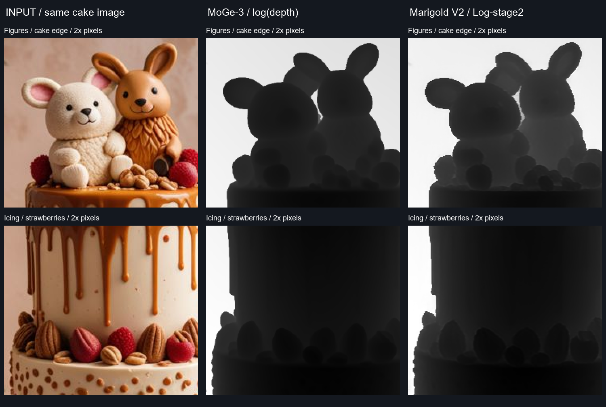

# Depth: MoGe-3 vs Marigold V2

같은 MoGe-nuke 케이크 이미지 한 장을 **H200에서 실제 추론**했습니다. 547×800 원본에 대해 MoGe-3와 Marigold V2를 비교합니다. 정답 Depth가 없는 시각적 비교이며, 어느 쪽의 거리 추정이 더 정확한지 판정하는 벤치마크는 아닙니다.

## 먼저 알아둘 값의 차이

| | MoGe-3 | Marigold V2 |
|---|---|---|
| 모델 출력 | Metric depth 추정 | Log-stage2 상대 log-depth |
| 절대 거리 | 모델이 추정한 스케일; 이 사진에서는 정확도 미검증 | 미터 단위가 아님. 이미지마다 스케일·오프셋이 미정 |
| 비교 이미지 표시 | 양수 Depth에 log 적용 후 2–98 percentile을 0–1로 매핑 | 원본 log-depth의 2–98 percentile을 0–1로 매핑 |
| 밝기 방향 | 멀수록 밝게 | 멀수록 밝게 |
| 저장된 EXR | 원본 Depth + `depth.Z` | 원본 log-depth + `depth.Z` |

두 결과는 **각각의 표시 범위로 정규화**했습니다. 따라서 같은 밝기가 같은 실제 거리를 의미하지 않습니다. 원본 EXR에는 이 표시 변환을 적용하지 않았습니다. 서로 다른 단위의 원본 값을 빼서 오차 지도로 제시하지 않습니다.

Marigold의 값 해석은 [공식 Depth 모델 설명](https://github.com/huawei-bayerlab/marigold-v2#checkpoints)을 따릅니다. 어댑터는 공식 `FolderDepthPrediction`과 같이 디코더 RGB 평균을 사용하며, 자체적인 지수 변환·clamp·프레임별 정규화를 넣지 않습니다.

## 보이는 차이

- 두 모델 모두 케이크·장식과 배경을 분리하고 큰 깊이 관계를 비슷하게 표현합니다.
- 이 이미지에서 Marigold는 인형과 딸기 주변의 작은 굴곡을 더 드러냅니다. 경계와 일부 표면에는 작은 불규칙성도 보입니다.
- MoGe-3는 케이크 원통과 인형의 넓은 면을 더 매끈하게 표현합니다.
- Normal 비교에서 보인 세부 묘사 차이가 Depth에서도 그대로 정확도 향상을 뜻하지는 않습니다. 필요한 마스크·합성 효과에 맞춰 판단하는 편이 좋습니다.

## 실행 조건과 측정

NVIDIA H200 / Python 3.10 / PyTorch 2.10.0+cu128. 각각 별도 프로세스에서 실행했으며, 아래 warm 시간은 모델 로딩 후 **두 번째 추론 한 번**의 측정값입니다. Nuke 네트워크 왕복과 파일 쓰기는 포함하지 않습니다.

| 항목 | MoGe-3 | Marigold V2 Depth |
|---|---:|---:|
| 설정 | resolution level 9, refine 3, FP32 | native 544×800, NF4/BF16, seed 2025 |
| 두 번째 추론 | 0.296초 | 0.529초 |
| 추론 중 peak allocated | 7.36 GiB | 14.48 GiB |
| 추론 중 peak reserved | 8.49 GiB | 15.93 GiB |
| 원본 출력 범위 | 1.5046–2.7669 | −1.0–1.0 |

Marigold의 출력 범위는 **이 샘플에서 관측한 값**입니다. 어댑터가 −1~1로 잘라내는 것은 아닙니다. 속도와 메모리는 환경·해상도에 따라 달라지며, H200 결과를 데스크톱 GPU 성능으로 해석하면 안 됩니다.

**출력 전환 검증:** 동일한 GPU backbone에서 Depth → Normals → Depth → Normals 순서로 실행했습니다. 같은 seed의 각 결과는 왕복 전환 전후 최대 절대 차이 **0.0**이었습니다. 선택한 작업의 LoRA/decoder와 prompt만 교체하며, 두 출력을 동시에 계산하지 않습니다.

[전체 측정 JSON](depth-comparison.json) · [재현 스크립트](../tools/compare_depth.py)

## Nuke에서 사용

1. **Nodes → ML → Marigold V2 → Marigold V2**로 노드를 만듭니다.
2. **output = Depth (relative log)**를 선택합니다. RGB는 원본 Depth 미리보기이며 `depth.Z`에도 같은 값이 나옵니다. 첫 선택 시 Depth 모델 파일이 필요합니다.
3. Viewer에서 depth 채널을 선택하거나, 별도 Expression/Grade로 near/far를 보기 좋게 매핑합니다. 음수와 좁은 범위 때문에 원본이 어둡게 보일 수 있습니다.
4. 데이터 저장은 **원본 노드 → Write / EXR / all channels / 32-bit float / raw**로 합니다. 표시용 Expression 뒤에서 저장하지 마세요.
5. ZDefocus나 거리 기반 효과에 넣을 때는 장면에 맞게 Depth 값을 변환합니다. 단순히 `depth.Z`라는 이름이 붙었다고 물리적인 카메라 거리가 되지는 않습니다.

Normals가 필요하면 같은 노드의 output을 Normals로 바꾸세요. 둘 다 필요한 리라이팅·합성 작업에서는 노드를 복제해 각각 선택하면 됩니다. 기본 사용에서 두 모델을 동시에 실행할 이유는 없습니다.

영상은 프레임마다 독립 추론합니다. seed를 고정해도 내용과 상대 깊이 스케일이 흔들릴 수 있으며, 자동 시간축 안정화는 없습니다.

## 예제 다운로드

[MarigoldV2-Nuke-depth-comparison.zip](https://github.com/tardis7732/MarigoldV2-Nuke/releases/download/v0.2.0/MarigoldV2-Nuke-depth-comparison.zip)을 프로젝트 폴더에 풀고 `examples/depth_comparison/Depth_Comparison.nk`를 엽니다.

- Viewer **1 원본 / 2 MoGe-3 / 3 Marigold V2 / 4 live 재계산**.
- Viewer 3은 저장된 Marigold 결과입니다. 저장된 EXR은 GPU 모델을 로딩하지 않습니다.
- `MOGE_RAW`, `MARIGOLD_RAW`: 원본 값과 `depth.Z`.
- `*_PREVIEW`: 위 비교 이미지와 같은 고정 표시 범위. 새 이미지에 맞게 범위를 조절하세요.
- `MARIGOLD_LIVE`: 새 통합 노드. output으로 Normals/Depth를 선택합니다.
- `WRITE_RAW_DEPTH`: 원본 float 데이터 저장. Viewer 4나 Write를 실행해야 live 모델이 로딩됩니다.

## 참고

- UI·OFX 구조와 케이크 예제: [Sumit Chatterjee / MoGe-nuke](https://github.com/sumitchatterjee13/MoGe-nuke), revision `4e9213e4`.
- Marigold V2: [huawei-bayerlab/marigold-v2](https://github.com/huawei-bayerlab/marigold-v2), revision `18466672`.
- Marigold 모델 revision: `cdf9810fb690886391a63aec012b5f501064fb0d`.
- Qwen 모델 revision: `d3968ef930e841f4c73640fb8afa3b306a78167e`.
