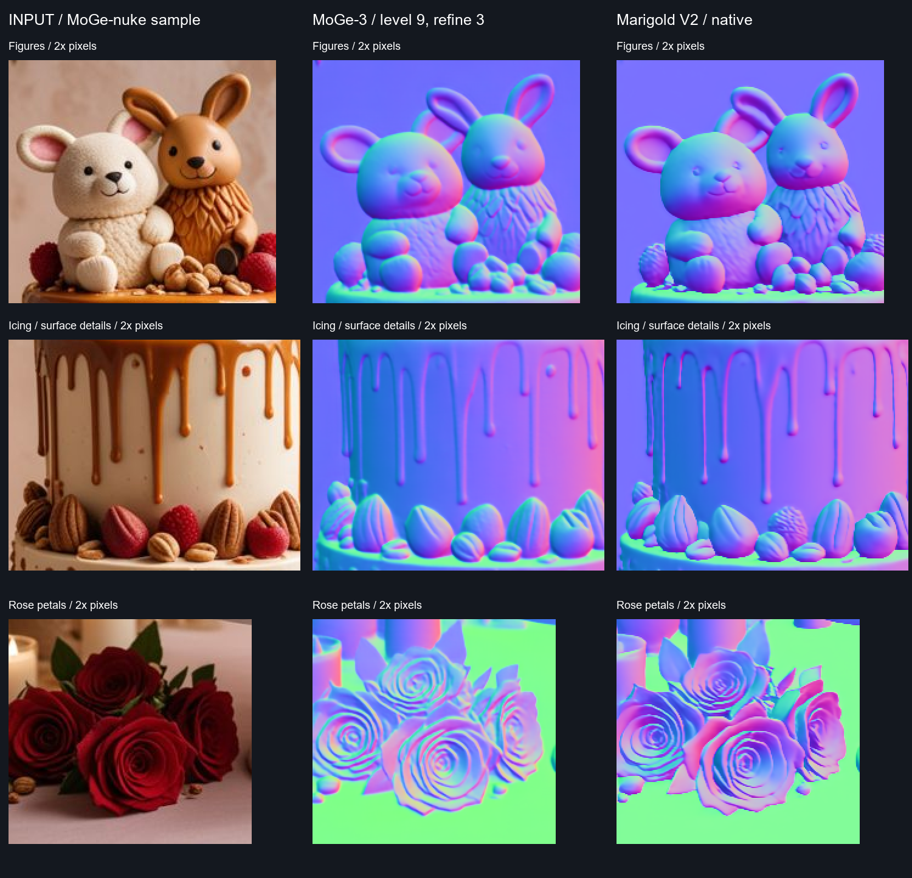

# MoGe-3 vs Marigold V2: 같은 예제 한 장 비교

MoGe-nuke README에 쓰인 **케이크·인형 사진 한 장**을 두 모델로 새로 처리했습니다. 이 예제에서는 **Marigold V2가 눈·입과 딸기 표면 같은 작은 디테일을 더 뚜렷하게 표현**했고, **MoGe-3는 얼굴과 케이크의 큰 곡면을 더 매끈하게 표현**했습니다. 이는 아래 결과에 대한 시각적 관찰입니다. 정답 노멀이 없는 단일 이미지이므로 전체 정확도 순위나 정량 성능으로 해석할 수 없습니다.


## 확대해서 보이는 차이



| 부위 | MoGe-3 | Marigold V2, native |
|---|---|---|
| 인형 얼굴 | 둥근 볼의 변화가 부드럽지만 눈과 입이 약하게 보임 | 눈·코·입의 경계가 더 선명함. 일부 작은 경계는 더 거칠게 보임 |
| 흘러내린 아이싱 | 큰 곡면과 드립의 흐름이 매끈함 | 드립 끝과 얇은 경계가 또렷하지만 일부 경계가 각지게 보임 |
| 딸기와 장식 | 딸기 표면을 비교적 매끈하게 추정 | 딸기 표면의 오돌토돌한 무늬를 더 많이 반영 |
| 장미 | 촘촘한 동심선 형태의 꽃잎 경계가 나타남 | 넓은 꽃잎 면의 방향 변화가 더 강하게 나타남. 어느 쪽 형상이 맞는지는 사진만으로 확정 불가 |

단순히 더 날카롭거나 알록달록하다고 더 정확한 법선은 아닙니다. 특히 표면 색·텍스처를 실제 요철로 잘못 해석했는지는 이 자료만으로 검증할 수 없습니다. 투명 꽃병과 가려진 경계 역시 정답 형상을 검증하지 않았습니다.

## 실행 조건

실행일: **2026-09-16**. Linux, NVIDIA H200, Python 3.10.19, PyTorch 2.10.0+cu128. 두 모델은 **클라우드 Python 백엔드에서 실행**했고, Nuke에서는 저장된 결과 EXR을 읽어 검증했습니다. 이 측정은 Nuke OFX 전체 처리 시간을 뜻하지 않습니다.

| 항목 | MoGe-3 | Marigold V2 native |
|---|---|---|
| 입력 사진 | 동일한 547 × 800 sRGB | 동일 |
| 모델 해상도 설정 | level 9, 3600 tokens | 544 × 800 |
| 추론 설정 | refine 3, FP32 기본값 | NF4 가중치, BF16 연산, seed 2025 |
| 출력 | 547 × 800 signed XYZ EXR | 동일 |
| 첫 추론 / 두 번째 추론 | 22.553초 / **1.593초** | 1.138초 / **0.506초** |
| 모델 로딩 | 22.01초 | 83.03초 |
| 추론 중 PyTorch 최대 할당 메모리 | 7.35 GiB | 14.48 GiB |

Marigold 입력 크기는 16의 배수로 맞췄습니다. 모든 결과는 원본 크기로 복원하고 단위 벡터로 정규화했습니다. 바닥 선택·평면 피팅·바닥 법선 후처리는 사용하지 않았습니다.

각 설정을 두 번 실행하고 두 번째 결과를 저장했습니다. 시간은 CUDA 동기화를 포함한 Python 호출의 벽시계 시간이며 이미지 저장은 제외했습니다. 모델·수치 정밀도·내부 해상도 처리 방식이 다르므로 속도 수치를 모델 구조 자체의 공정한 벤치마크로 일반화하지 마세요. 메모리는 추론 구간의 PyTorch 할당량이며 로딩 최고치나 GPU 전체 사용량은 아닙니다.

검증: 두 결과 모두 전체 픽셀의 값이 유한하고, 유효 마스크 비율은 100%, 단위 벡터 길이 최대 오차는 약 `1.79e-7`이었습니다. Nuke에서 비교 스크립트를 다시 열어 파일 경로·547 × 800 크기·표본 XYZ를 확인했습니다. 이것은 파일/벡터 유효성 검사이며 추정 정확도 검사가 아닙니다. 원시 기록은 [model-comparison.json](model-comparison.json)에 있습니다.

## 좌표축과 표시

- MoGe에는 참고 플러그인의 `normal_space=nuke`를 사용했습니다. [해당 데몬](https://github.com/sumitchatterjee13/MoGe-nuke/blob/4e9213e4a2a77d623daff5e301e80262e3d9d7fb/daemon/moge_daemon.py)은 OpenCV 법선에 `[1, -1, -1]`을 곱합니다.
- Marigold V2에는 추가 축 반전을 적용하지 않았습니다. 공식 V2의 [Hypersim 학습 전처리 경로](https://github.com/huawei-bayerlab/marigold-v2/blob/18466672fb8661152434a0efe1184939164cda19/scripts/hypersim_normals/download_and_preprocess_hypersim_normals.sh)와 [실제 전처리 코드](https://github.com/prs-eth/Marigold/blob/ac915287aaa4e5fd5fe578322735c7c411a1f263/script/normals/dataset_preprocess/hypersim/preprocess_hypersim_normals.py)는 카메라 공간 법선을 사용합니다. [Hypersim 좌표 규약](https://github.com/apple-aiml-research/ml-hypersim#coordinate-conventions)은 X 오른쪽, Y 위, Z 시선 반대 방향입니다. 이 근거로 두 출력을 같은 축 규약으로 비교했습니다.
- 두 결과 모두 표시 RGB는 `XYZ * 0.5 + 0.5`, 추가 감마 없음입니다. 원본 사진은 sRGB 값을 그대로 보여줍니다. 시각적으로 맞추기 위한 회전·색 보정·샤픈은 적용하지 않았습니다. 확대 이미지는 같은 좌표를 최근접 보간으로 2배 확대했습니다.

## Nuke에서 열기

[비교 예제 ZIP](https://github.com/tardis7732/MarigoldV2-Nuke/releases/download/v0.1.0/MarigoldV2-Nuke-model-comparison.zip)을 프로젝트 폴더에 풀고 [examples/model_comparison/Normals_Comparison.nk](../examples/model_comparison/Normals_Comparison.nk)를 여세요. 모델을 다시 로딩하지 않습니다.

Viewer **1 원본 / 2 MoGe-3 / 3 Marigold V2 native**. Viewer A/B 입력을 선택해 와이프로 비교할 수 있습니다. `Read`에는 signed XYZ, `Expression`에는 표시용 RGB가 있습니다. Viewer process는 `None`으로 유지하세요.

## 출처와 재현

- 원본: [MoGe-nuke의 docs/sample.jpg](https://github.com/sumitchatterjee13/MoGe-nuke/blob/4e9213e4a2a77d623daff5e301e80262e3d9d7fb/docs/sample.jpg). README 예시의 원본 파일을 그대로 사용했습니다. 출처 저장소 저작권 및 MIT 고지는 [Third-party notices](../THIRD_PARTY_NOTICES.md)에 보존했습니다.
- 원본 SHA-256: `7ddd187d91ebc2cf626bc51a26e1fc71d478237ce348732ae547f83655f05260`.
- MoGe-nuke 코드: `4e9213e4a2a77d623daff5e301e80262e3d9d7fb`; 가중치: `Sumitc13/moge-3-vitg-safetensors/model.safetensors`, SHA-256 `685c5bc2bc1acfac86b928255c2c5397a7de4824870ade392e2ba1f74c2ce52b`.
- Marigold V2 코드: `18466672fb8661152434a0efe1184939164cda19`; 어댑터: `2f999d1`. Qwen 및 Marigold 가중치 리비전은 [다운로드 스크립트](../tools/download_normals.py)에 고정되어 있습니다.
- 실행 코드: [compare_moge_marigold.py](../tools/compare_moge_marigold.py), 그림 생성: [package_model_comparison.py](../tools/package_model_comparison.py), Nuke 파일 생성/검증: [build_comparison_nuke.py](../tools/build_comparison_nuke.py).

재실행 시 하나의 작업 폴더 아래 `adapter/`, `moge-nuke/`, `marigold-v2/`를 위 리비전으로 준비하고 Python 3.10 환경에 PyTorch 2.10.0+cu128, torchvision 0.25.0+cu128, 두 모델 패키지와 OpenEXR을 설치합니다. MoGe 패키지는 `moge-nuke/third_party/MoGe`에 있습니다. Marigold 가중치는 `adapter/tools/download_normals.py --assets "$BASE/assets"`로 받으며, MoGe 체크포인트는 `$BASE/assets/moge-3/model.safetensors`에 둡니다.

```bash
# BASE: 위 체크아웃, 환경, 가중치를 준비한 절대 경로
export OMP_NUM_THREADS=8
"$BASE/.venv/bin/python" tools/compare_moge_marigold.py --base "$BASE" --model moge
"$BASE/.venv/bin/python" tools/compare_moge_marigold.py --base "$BASE" --model marigold
```

두 명령은 순서대로 실행해 모델 간 GPU 메모리를 반환합니다. 결과는 `$BASE/results/`에 생성됩니다. 그림 생성 도구는 원본 `sample.jpg`를 결과 폴더에 복사한 뒤 Windows에서 `--results`로 해당 폴더를 지정해 실행합니다.

## 참고 GitHub

이번 Nuke 통합에서 참고한 저장소: **[Sumit Chatterjee / MoGe-nuke](https://github.com/sumitchatterjee13/MoGe-nuke)**. OFX 프런트엔드와 미니 호스트의 기반이며, 위 비교에 사용한 케이크 예제의 출처입니다.
