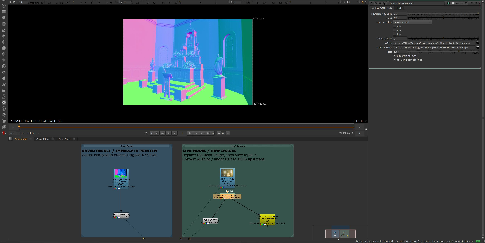
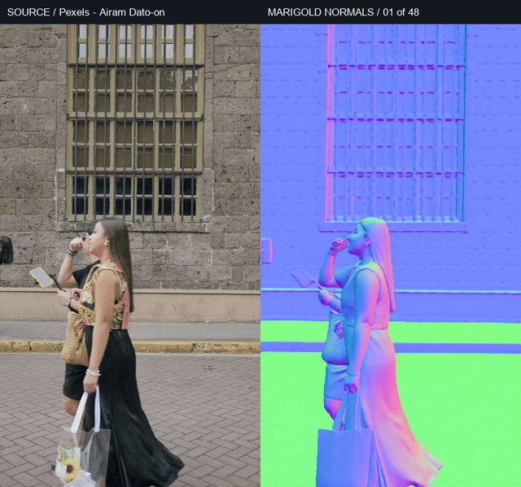

# Marigold V2 Normals for Nuke

이미지와 영상 시퀀스의 표면 법선을 계산하는 Nuke OFX 플러그인입니다. 외부 Python 데몬에서 GPU로 모델을 실행합니다.

[메인 README](../README.md) · [다운로드](https://github.com/tardis7732/MarigoldV2-Nuke/releases/latest) · [노드 설명](NODES.md)



## 설치

Windows x64, CUDA GPU, Git, uv, 외부 Python이 필요합니다. RTX 5070 Ti 16GB에서 긴 변 512를 검증했습니다.

```powershell
git clone https://github.com/tardis7732/MarigoldV2-Nuke.git
cd MarigoldV2-Nuke
powershell -ExecutionPolicy Bypass -File tools/setup_windows.ps1
powershell -ExecutionPolicy Bypass -File install.ps1
```

모델 다운로드는 약 43GB입니다. 소스 빌드에는 Visual Studio C++ Build Tools가 필요합니다. 빌드 대신 Release의 `MarigoldV2-Nuke-Windows-x64.zip`을 프로젝트 폴더에 풀고 `install.ps1 -SkipBuild`를 실행할 수 있습니다.

설치 후 Nuke를 재시작하면 **Nodes → ML → Marigold V2 → Normals** 메뉴가 생깁니다.

## 예제

Release의 `MarigoldV2-Nuke-examples.zip`을 프로젝트 폴더에 풀어 주세요.

- `examples/Normals_Still.nk`: 교회 이미지와 실제 계산된 Normal.
- `examples/video_demo/Normals_Video.nk`: 4초·12fps·48프레임 영상 예제.
- Viewer **1: 저장된 결과 / 2: 원본 / 3: 실시간 재계산**.
- 저장된 결과는 모델을 로딩하지 않고 볼 수 있습니다. 라이브 노드를 인식하려면 OFX 설치는 필요합니다.



[비교 MP4](media/video-comparison.mp4). 영상 출처: [Airam Dato-on / Pexels](https://www.pexels.com/video/urban-street-life-with-people-walking-by-historic-building-35958383/).

## 사용법

1. `INPUT_IMAGE`에 sRGB JPG/PNG를 연결합니다. ACEScg나 HDR 이미지는 앞에서 적절히 변환합니다.
2. `MARIGOLD_NORMALS`의 긴 변을 512로 두고 Viewer 3으로 확인합니다.
3. 첫 로딩은 약 1분, 이후 프레임은 측정 환경에서 약 9~15초 걸렸습니다.
4. `WRITE_LIVE_NORMALS`에서 raw / 32-bit float EXR을 저장합니다.

`LIVE_PREVIEW`는 표시용 변환입니다. XYZ의 −1~+1 값을 `값 × 0.5 + 0.5`로 0~1 RGB로 바꿉니다. 법선 데이터 저장은 변환 전 OFX 출력에 연결합니다.

영상 48프레임은 실제 Nuke에서 약 **10분 49초**에 계산했습니다. 모든 EXR과 MP4 프레임을 검증했습니다. 프레임별 독립 추론이므로 영상에서 흔들림이 생길 수 있으며, 시간축 안정화는 적용하지 않았습니다. 전체 화면 법선 추정만 수행하고 바닥 선택이나 평면 추정은 포함하지 않습니다.

데몬 오류는 `output/daemon.log`를 확인합니다. 캐시가 남으면 **Clear selected node cache**를 실행하거나 `cacheRevision`을 올리세요. 바이너리 업데이트 후에는 Nuke를 완전히 재시작해야 합니다.

출처와 라이선스: [Third-party notices](../THIRD_PARTY_NOTICES.md).
